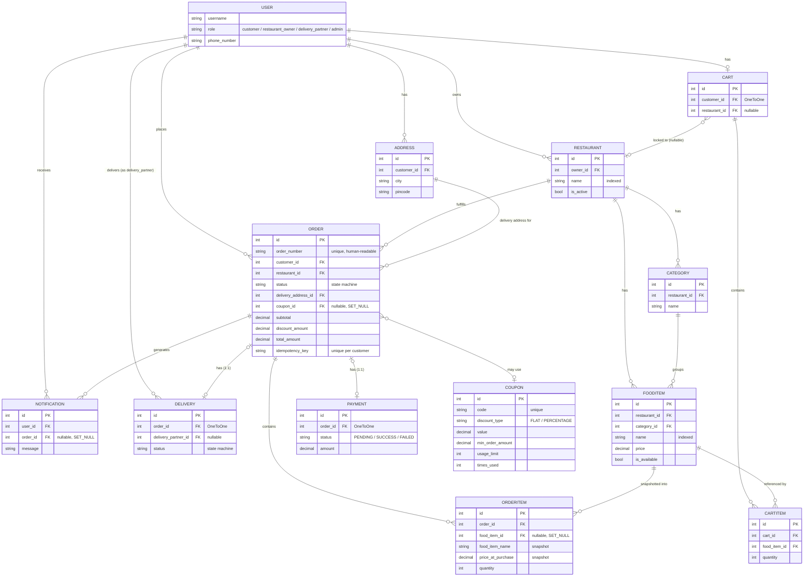

# WebAura — Entity-Relationship Diagram

Rendered with [Mermaid](https://mermaid.js.org/) — GitHub, GitLab, and most
modern Markdown viewers render this block natively with no extra tooling.
If your viewer doesn't, paste the block between the fences into
https://mermaid.live to see it rendered.

## Notes on relationships that aren't obvious from the diagram shape

- **`Order.coupon`** is `SET_NULL`: deleting a `Coupon` never deletes or
  corrupts past orders — `Order.discount_amount` is a snapshot taken at
  apply-time, not a live computation off the coupon, so historical order
  totals are unaffected either way.
- **`OrderItem.food_item`** is also `SET_NULL`: an `OrderItem` keeps its own
  `food_item_name`/`price_at_purchase` snapshot, so a deleted or
  price-changed `FoodItem` never alters what a past order shows.
- **`Cart.restaurant`** is nullable and reset to `None` whenever the cart is
  emptied — this is what enforces the "single-restaurant cart" rule at the
  application level (see `restaurants/views.py::CartItemCreateView`).
- **`Payment`** and **`Delivery`** are both strict `OneToOneField`s on
  `Order` — at most one payment record and one delivery record can ever
  exist per order.